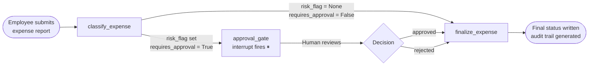
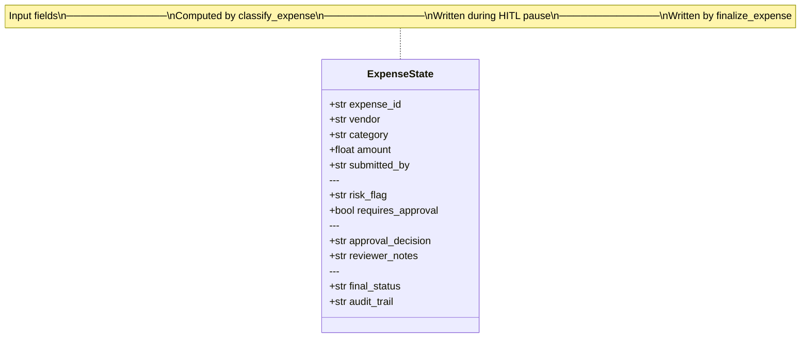
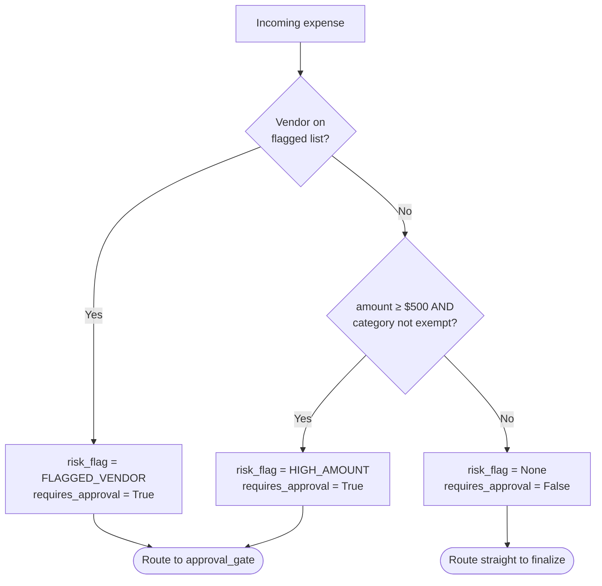
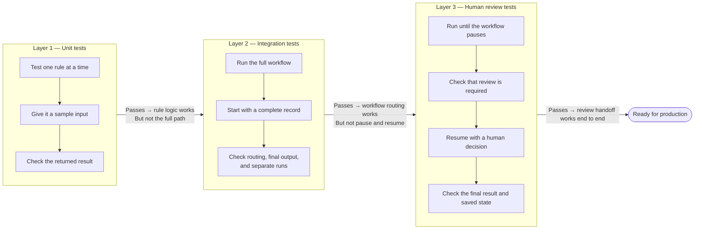
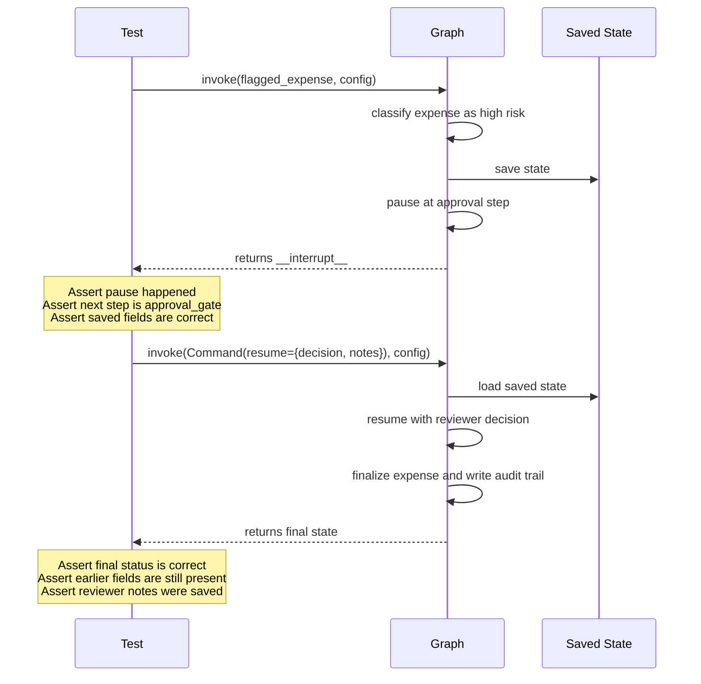
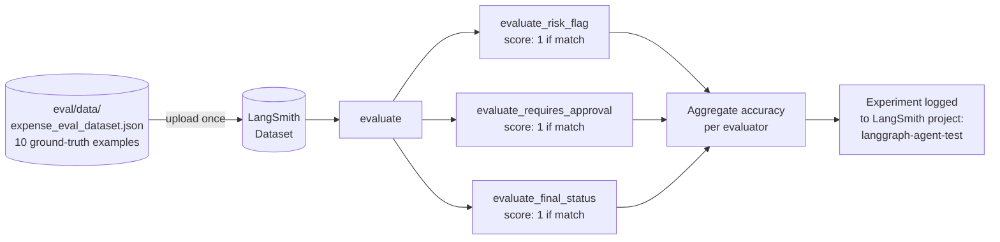
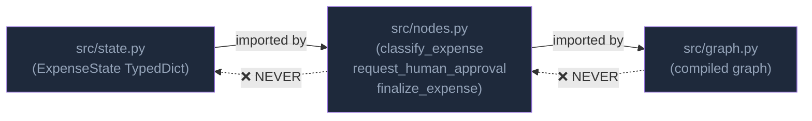

# Project Explainer
## langgraph-agent-testing

---

## What Is This Project About?

This project answers one question: **how do you properly test an AI agent that makes decisions with real financial consequences?**

The agent processes employee expense reports. It reads a submitted expense, decides whether it needs a human to review it, pauses execution if it does, waits for a reviewer's decision, and then writes a final status. The domain was chosen deliberately — every reader has filed or approved an expense report, the failure mode is visceral (a $3,500 hotel charge approved with no human ever seeing it), and the approval logic is deterministic enough to test precisely.

The project is the companion code for a Medium article titled:  
> **"You Shipped an AI Agent to Production Without Testing It. So Did I."**

The confession at the heart of the article: the author tested the individual Python functions, they all passed, and the agent went to production. Then a flagged expense auto-approved itself — because the *graph's structure*, its routing logic, and its human-in-the-loop pause mechanism were never tested as a graph.

---

## The Agent: What It Does



The agent has exactly **three nodes**:

| Node | File | What it does |
|---|---|---|
| `classify_expense` | `src/nodes.py` | Reads vendor, amount, category → decides if human review is needed |
| `approval_gate` | `src/nodes.py` | Pauses the graph with `interrupt()` → waits for a human reviewer |
| `finalize_expense` | `src/nodes.py` | Writes final status (`cleared` / `approved` / `rejected`) + audit trail |

---

## The Data

### State: what travels through the graph

Every expense report is represented as an `ExpenseState` TypedDict with fields across four groups:



### Classification rules

`classify_expense` applies these rules in order:



**Exempt categories** (threshold does not apply): `equipment`, `software`  
**Flagged vendors** (always requires review, any amount): `casino royale`, `ultra luxury resort`, `first class airways`, `platinum club`  
**High-amount threshold**: `$500.00` (inclusive)

### Evaluation dataset: `eval/data/expense_eval_dataset.json`

10 ground-truth examples covering every classification path:

| ID | Vendor | Category | Amount | Expected risk_flag | Expected final_status |
|---|---|---|---|---|---|
| EVAL-001 | Corner Café | meals | $35 | `None` | `cleared` |
| EVAL-002 | Dell Technologies | equipment | $1,800 | `None` | `cleared` |
| EVAL-003 | City Parking | parking | $22 | `None` | `cleared` |
| EVAL-004 | Grand Hyatt | lodging | $3,500 | `HIGH_AMOUNT` | *(paused)* |
| EVAL-005 | United Airlines | travel | $2,100 | `HIGH_AMOUNT` | *(paused)* |
| EVAL-006 | Le Bernardin | meals | $750 | `HIGH_AMOUNT` | *(paused)* |
| EVAL-007 | Casino Royale | meals | $60 | `FLAGGED_VENDOR` | *(paused)* |
| EVAL-008 | Ultra Luxury Resort | lodging | $500 | `FLAGGED_VENDOR` | *(paused)* |
| EVAL-009 | Business Hotel | lodging | $500 | `HIGH_AMOUNT` | *(paused)* |
| EVAL-010 | Business Hotel | lodging | $499.99 | `None` | `cleared` |

EVAL-009 and EVAL-010 are the boundary pair — $500.00 triggers the flag, $499.99 does not.

---

## The Hypothesis

> **Testing individual node functions is necessary but not sufficient.  
> A graph can be broken in ways that make every individual function test pass.**

Specifically, three things can go wrong in a LangGraph agent that unit tests are structurally blind to:

1. **Routing failure** — the conditional edge sends flagged expenses straight to `finalize_expense` instead of `approval_gate`. Every function test passes; the graph silently auto-approves.

2. **State propagation failure** — values written by `classify_expense` (e.g. `risk_flag = "HIGH_AMOUNT"`) are not visible to `finalize_expense` because of a state schema mismatch. Individual functions return correct dicts; the graph produces a broken audit trail.

3. **HITL cycle failure** — `interrupt()` never fires, or the graph resumes on the wrong branch, or state written before the pause is lost after it. A test that calls `invoke()` only once cannot detect any of these.

The three-layer test suite is designed to make each failure mode visible at the earliest possible layer.

---

## The Three Test Layers


---

### Layer 1 — Unit Tests (`tests/test_unit.py`)

**What it tests:** Individual node functions in complete isolation. The graph object is never created.

**How it works:**
```python
# Import the function directly — no graph, no LangGraph, no network
from src.nodes import classify_expense

def test_large_hotel_charge_flagged():
    state = {"vendor": "Grand Hyatt", "category": "lodging", "amount": 3500.00, ...}
    result = classify_expense(state)
    assert result["risk_flag"] == "HIGH_AMOUNT"
    assert result["requires_approval"] is True
```

**What it proves:**
- Each classification rule fires on the correct inputs
- Edge cases (exact threshold, exempt categories, flagged vendor case-insensitivity) are handled correctly
- The fail-safe: if `approval_decision` is missing on a flagged expense, `finalize_expense` must default to `"rejected"` — never auto-approve

**What it cannot prove:**  
Whether the conditional edge in `graph.py` routes a flagged expense to `approval_gate` vs. straight to `finalize`. That is a graph-structure concern invisible to function tests.

**Run time:** < 0.1s — no external calls, fully deterministic.

---

### Layer 2 — Integration Tests (`tests/test_integration.py`)

**What it tests:** The full compiled graph end-to-end, with a real MemorySaver checkpointer.

**Key pattern — unique thread ID per test:**
```python
def _unique_thread() -> dict:
    return {"configurable": {"thread_id": f"integ-{uuid.uuid4().hex}"}}
```
UUID-based thread IDs prevent state bleed between tests even in the same process.

**What it proves:**
- The conditional edge routes correctly: clean expenses reach `final_status = "cleared"` in one invoke; flagged expenses land on `approval_gate` (confirmed via `__interrupt__` in result)
- State written by `classify_expense` is visible to `finalize_expense` — state propagation through the graph's merge logic works
- Thread A's state is never visible when querying Thread B's checkpoint (`get_state`)

**What it cannot prove:**  
Whether the graph resumes on the correct branch after a human decision, or whether state survives the pause. That requires a two-step invoke.

**Run time:** < 0.1s — MemorySaver, no LLM calls.

---

### Layer 3 — HITL Tests (`tests/test_hitl.py`)

**What it tests:** The full interrupt → pause → resume cycle. This is the layer that catches the production bug.

**The strict two-step pattern:**



**The revelation test:**
```python
def test_interrupt_is_present_in_step1_result(self, graph):
    config = _unique_thread()
    result = graph.invoke(_flagged_expense(), config)

    assert "__interrupt__" in result, (
        "This is the production bug: the agent is auto-approving flagged "
        "expenses without human review."
    )
```

If `interrupt()` never fires, this assertion fails with that exact message. Had this test existed before the production deploy, the bug would have been caught before shipping.

**What it proves:**
- The graph genuinely suspends — `invoke()` returns before `finalize_expense` runs
- State checkpointed in Step 1 is fully accessible in Step 2 (the persistence guarantee)
- The graph resumes on the correct branch — `"approved"` → `final_status = "approved"`, `"rejected"` → `final_status = "rejected"`
- The fail-safe: a `"rejected"` expense must never read `final_status = "approved"`

**Run time:** < 0.2s — MemorySaver, no LLM calls.

---

## The Evaluation Layer (`eval/langsmith_eval.py`)

The tests prove correctness in CI. The evaluation proves correctness *at scale, over named datasets, with a score you can put in a deployment gate*.



### Why evaluation ≠ tracing

| | Tracing | Evaluation |
|---|---|---|
| **Records** | What happened | Whether it was correct |
| **Scope** | Individual run | Named, versioned dataset |
| **Output** | Timeline + state log | Accuracy score |
| **Regression protection** | ❌ None | ✅ Score drops → CI blocks |
| **Deployable as a gate** | ❌ | ✅ |

**The key scenario:** If someone changes `HIGH_AMOUNT_THRESHOLD` from `$500` to `$750`, all traces look normal — the agent runs, no exceptions. But EVAL-009 (a $500 lodging expense) now clears without review. The evaluation dataset catches this because the ground-truth label still says `requires_approval: true`.

---

## Architectural Rule: One-Way Dependency

The entire test strategy depends on this import rule:



Because `nodes.py` never imports from `graph.py`, the unit tests can import any node function and call it with a plain dict — no graph object is instantiated, no checkpointer is created, no LangGraph machinery runs at all. This is the architectural decision that makes the unit test layer possible.

---

## Full Test Results

```
43 tests, 0 failures, 0 errors — run time: < 0.5s
```

| File | Tests | What passes |
|---|---|---|
| `test_unit.py` | 20 | All classification rules, edge cases, fail-safe on missing decision |
| `test_integration.py` | 10 | Routing, state propagation, thread isolation (5 threads simultaneously) |
| `test_hitl.py` | 13 | Interrupt fires, state persists, approved path, rejected path, flagged vendor path |

Run everything with:
```bash
uv run pytest tests/ -v
```

No OpenAI key required. No network. No LLM calls. Everything deterministic.
